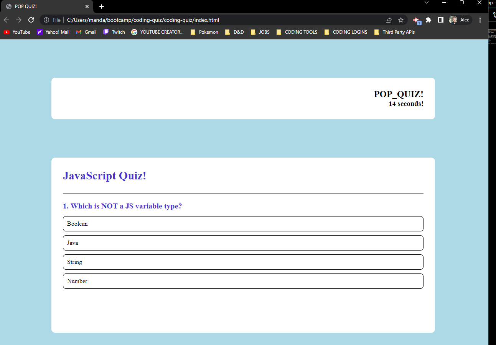

<a href="https://mandaark17.github.io/coding-quiz">Coding Quiz</a>

# coding-quiz
JavaScript Pop Quiz

## Description

This was a lot of code that I got confused on, I'm not gonna lie. This quiz should begin immediately and is only 4 average questions long. Each incorrect answer loses 5 seconds so be quick! This script includes a few buttons that change innerHTMLs, I couldn't get the highscore button to work and or be styled in time. I'm just done with this project and I want to move on, I'll submit and hopefully get SOME points.

## Credits
MIT LICENSE

## Tests

If you can debug this, I'd humor the onlook and learn something. Otherwise, I'm so over it.